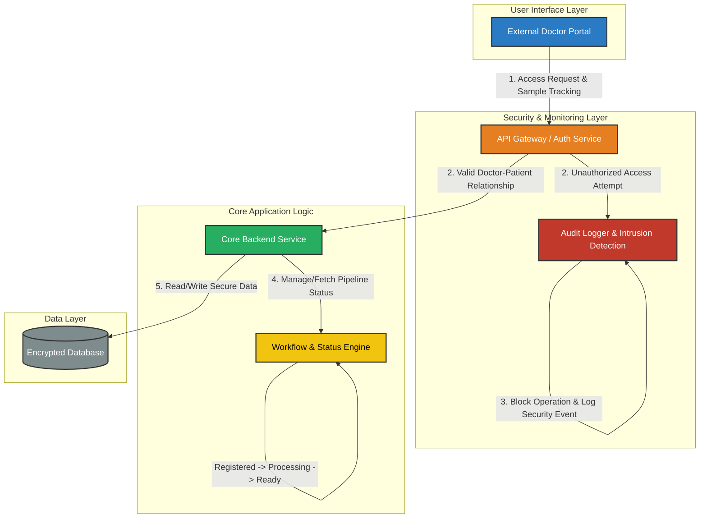

```mermaid
graph TD
    %% Component Definitions & Styling
    subgraph Frontend [User Interface Layer]
        UI[External Doctor Portal]
    end

    subgraph Security [Security & Monitoring Layer]
        Gateway[API Gateway / Auth Service]
        Audit[Audit Logger & Intrusion Detection]
    end

    subgraph Backend [Core Application Logic]
        Logic[Core Backend Service]
        Workflow[Workflow & Status Engine]
    end

    subgraph Storage [Data Layer]
        DB[(Encrypted Database)]
    end

    %% Relations and Data Flow
    UI -->|1. Access Request & Sample Tracking| Gateway
    
    Gateway -->|2. Unauthorized Access Attempt| Audit
    Audit -->|3. Block Operation & Log Security Event| Audit
    
    Gateway -->|2. Valid Doctor-Patient Relationship| Logic
    Logic -->|4. Manage/Fetch Pipeline Status| Workflow
    Workflow -->|Registered -> Processing -> Ready| Workflow
    
    Logic -->|5. Read/Write Secure Data| DB

    %% Component Visual Styles
    style UI fill:#2b7bc4,stroke:#333,stroke-width:2px,color:#fff
    style Gateway fill:#e67e22,stroke:#333,stroke-width:2px,color:#fff
    style Audit fill:#c0392b,stroke:#333,stroke-width:2px,color:#fff
    style Logic fill:#27ae60,stroke:#333,stroke-width:2px,color:#fff
    style Workflow fill:#f1c40f,stroke:#333,stroke-width:2px,color:#000
    style DB fill:#7f8c8d,stroke:#333,stroke-width:2px,color:#fff
```
